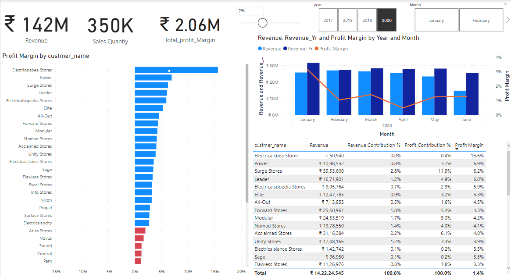
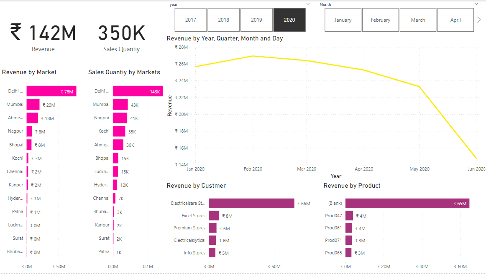
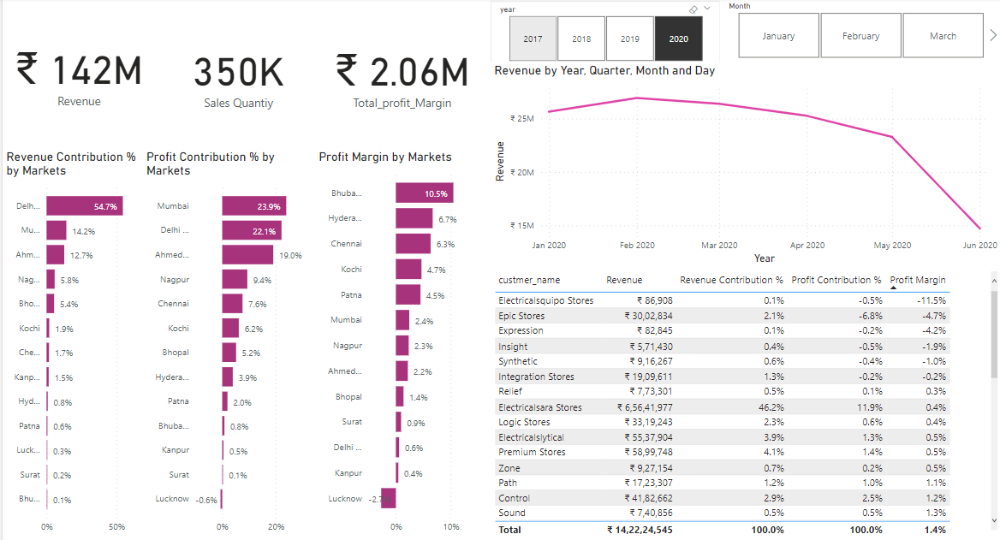

# Market-Sales-Dynamics

## Project Overview

Led a comprehensive Power BI sales analysis project that seamlessly integrated MySQL, conducted ETL operations, and implemented data cleaning techniques. The result is a dynamic dashboard offering actionable insights within the competitive computer hardware market.

## Key Features

- **Data Integration:** Successfully integrated MySQL database for streamlined data access.
- **ETL Operations:** Conducted effective Extract, Transform, Load operations for optimal data processing.
- **Data Cleaning:** Implemented robust data cleaning techniques to ensure data accuracy.
- **Dynamic Dashboard:** Developed a powerful Power BI dashboard for real-time decision-making.
- **Actionable Insights:** Provided valuable and actionable sales insights for the computer hardware market.

## Pages

  
  
  

